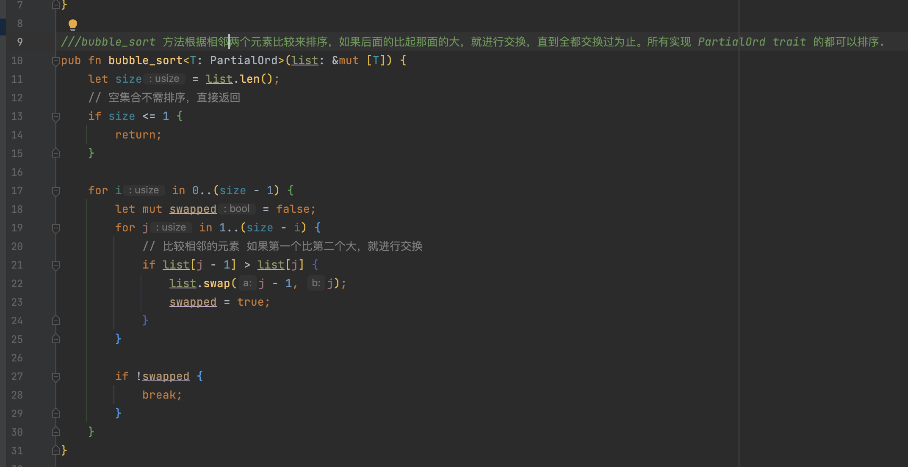
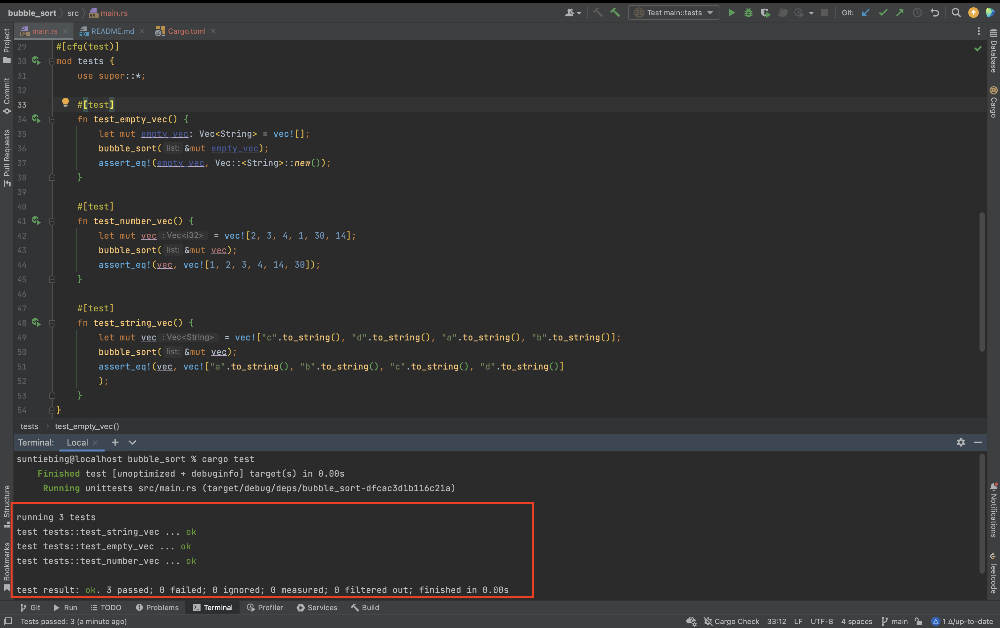

# bubble_sort(通过 RUST 实现冒泡排序)

bubble_sort 方法根据相邻两个元素比较来排序，如果后面的比起那面的大，就进行交换，直到全都交换过为止。

bubble_sort 方法代码截图如下：


为 bubble_sort 方法编写了三个测试(空集合，类型为 i32 的几个以及类型为 String 类型的集合)。
测试运行成功截图如下：

注：为了可以截下所有测试代码，上图的代码是没有格式化的，而正式提交的代码是经过格式化之后的。